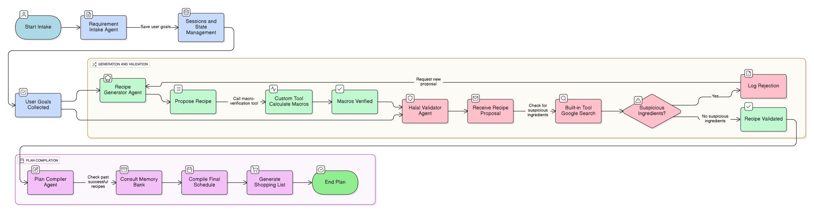

# Halal-Fit-Chef-Agent
## Multi-agent system for Halal and high-protein Indian meal planning

### Project Overview
The Halal-Fit Chef Agent is a specialized Concierge Agent designed to eliminate the complexity and time burden associated with creating meal plans that simultaneously satisfy strict **Halal compliance**, specific **nutritional goals** (e.g., high-protein), and regional **Indian cuisine** preferences.

---

### Problem Statement

Finding and validating recipes that meet the intersection of strict religious (Halal) and scientific (nutritional macros) requirements, while remaining culturally and regionally relevant (Indian cuisine), is extremely difficult. Generic recipe generators often fail on one of the following critical points:

1.  **Halal Ambiguity:** Inability to verify processed or ambiguous ingredients (like gelatin or specific oils).
2.  **Cultural Fit:** Suggesting non-Indian dishes or recipes requiring ingredients unavailable in local markets.
3.  **Time Sink:** Forcing the user to manually cross-reference nutritional data, ingredient sourcing, and religious guidelines.

The **Halal-Fit Chef Agent** solves this by automating the entire validation pipeline.

---

### Core Value
This multi-agent system provides immediate, high-trust value by:

* Time Reduction: Cutting manual search and validation time from an estimated 4 hours per week to under 10 minutes of initial interaction.
* Compliance Guarantee: Using specialized tools to verify ingredient compliance, ensuring all suggested recipes are religiously and nutritionally safe.

---

### Agent Architecture and Workflow
The solution employs a robust multi-agent system with sequential and parallel processing to handle complex logic efficiently.

### Agent Workflow Diagram

---

### Technical Concepts Demonstrated
This project demonstrates the successful application of the following core concepts from the course:
* Multi-Agent System (Sequential & Parallel):
    * Parallel: Simultaneous processing by the Generator and Validator agents for speed.
    * Sequential: The 3-step pipeline (Intake $\rightarrow$ Parallel Block $\rightarrow$ Compiler) ensures data integrity.
* Tools (Custom & Built-in):
    * Custom Tool: The calculate_nutritional_macros() function estimates nutrient counts on proposed recipes.
    * Built-in Tool: The Google Search_halal_verifier() function simulates real-time search for compliance checks on ingredients.
* Sessions & Memory:
    * State Management (session_service.py): Remembers user constraints across the workflow (demonstrating long-running operation capability).
    * Long Term Memory (memory_bank.py): Stores successful plans to prioritize user favorites in future runs.
* Observability: Logging implemented within the HalalValidatorAgent to track why a recipe was rejected (e.g., "REJECTED - Reason: CRITICAL FAIL").

---

### Setup and Run Instructions
Prerequisites
* Python 3.10+
* The git command line tool

1. Clone the Repository and Setup Environment
``# Clone the project (Replace with your actual repo link)
git clone https://github.com/yourusername/Halal-Fit-Chef-Agent-Capstone.git
cd Halal-Fit-Chef-Agent-Capstone``

``# Create and activate the virtual environment
python -m venv venv``
``# On Windows PowerShell:
.\venv\Scripts\Activate.ps1``

2. Install Dependencies
``pip install -r requirements.txt``

3. Run the Agent
``Execute the main script. The output log will detail every step of the agent workflow, from constraint collection to final plan compilation.
python main.py``

